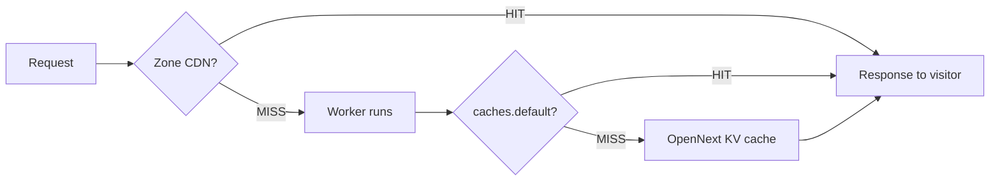
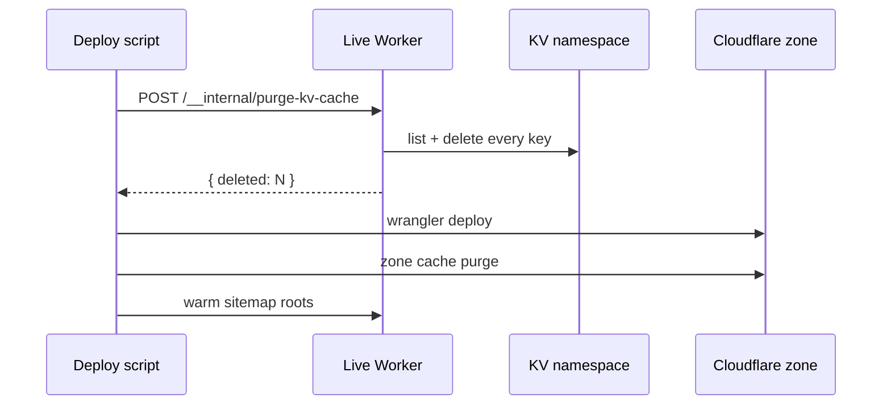

# Component Test Bed

This entry exists to verify every component renders correctly when fetched from R2 and rendered through the dynamic path. If something below renders broken or missing, the dynamic renderer has a gap that needs fixing before authors can rely on it.

## Headings and Inline Markup

Paragraphs render with proper spacing between them. The first paragraph is the introduction. The second carries inline marks: **bold text**, _italic text_, `inline code`, ~~strikethrough~~, and a [link to the architecture post](/blog/2026/04/21/website-infrastructure-design).

### Subsection Heading

Smaller heading depth. Should appear in the table of contents at depth 3.

#### Deeper Heading

Depth 4 — should also appear in the TOC.

## Lists

Unordered list:

- First item
- Second item
- Third item, with a [link inline](/blog)

Ordered list:

1. First step
2. Second step
3. Third step

Nested list:

- Outer item
  - Inner item
  - Inner item with `inline code`
    - Deeper item
- Another outer item

Task list:

- [x] Completed task
- [ ] Open task
- [ ] Another open task

## Links

- Internal: [reflections index](/claude/reflections)
- External: [Nextra documentation](https://nextra.site)
- Anchor: [back to introduction](#component-test-bed)

## Code Blocks

### Plain (no language hint)

```
This block has no language hint.
It should still render with the proper card styling.
```

### Shell

```shell
curl -sI https://axivo.com | grep -iE "age:|cf-cache-status|cf-ray"
cf-ray: 9f194d1d2bd4ab7c-YYZ
cf-cache-status: HIT
age: 2
```

### JavaScript

```javascript
const statusTtl = {
  301: 86400,
  302: 0,
  404: 60,
  503: 0,
};

function setTtl(response) {
  const ttl = statusTtl[response.status];
  if (ttl === undefined) {
    return response;
  }
  const normalized = new Response(response.body, response);
  normalized.headers.set(
    "cache-control",
    ttl === 0 ? "no-store" : `public, s-maxage=${ttl}`,
  );
  return normalized;
}
```

### JSON

```json
{
  "name": "axivo-website",
  "compatibility_date": "2026-04-01",
  "main": "scripts/worker.js"
}
```

### JSX

```jsx
function Greeting({ name }) {
  return <p>Hello, {name}</p>;
}
```

### YAML

```yaml
name: deploy
on:
  push:
    branches: [main]
jobs:
  build:
    runs-on: ubuntu-latest
```

### With filename

```js filename="scripts/worker.js"
const statusTtl = {
  301: 86400,
  404: 60,
  503: 0,
};
```

### With copy button

```shell copy
npm run deploy
```

### With line numbers

```js showLineNumbers
function setTtl(response) {
  const ttl = statusTtl[response.status];
  if (ttl === undefined) {
    return response;
  }
  return response;
}
```

### With line highlighting (single line + range)

<!-- prettier-ignore-start -->
```js {1,4-5}
function setTtl(response) {
  const ttl = statusTtl[response.status]
  if (ttl === undefined) {
    return response
  }
  return response
}
```
<!-- prettier-ignore-end -->

### With substring highlighting

<!-- prettier-ignore-start -->
```js /response/
function setTtl(response) {
  const ttl = statusTtl[response.status]
  return response
}
```
<!-- prettier-ignore-end -->

### With substring highlighting (specific occurrence)

<!-- prettier-ignore-start -->
```js /response/2
function setTtl(response) {
  const ttl = statusTtl[response.status]
  return response
}
```
<!-- prettier-ignore-end -->

### Combined: filename + line numbers + line highlighting + copy

<!-- prettier-ignore-start -->
```js filename="scripts/worker.js" showLineNumbers copy {2-4}
function setTtl(response) {
  const ttl = statusTtl[response.status]
  if (ttl === undefined) {
    return response
  }
  return response
}
```
<!-- prettier-ignore-end -->

### Inline code with language hint

<!-- prettier-ignore-start -->
Inline code with JSX highlighting: `let x = 1{:jsx}` should render with syntax colors inline.
<!-- prettier-ignore-end -->

Inline code without language hint: `plain inline code` should render as plain monospace.

### ANSI

<!-- prettier-ignore-start -->
```ansi
[0m[0;32m✓[0m Build successful
[0m[0;33m

## Image Component

Same image via the custom `<Image>` component:

<Image src="/blog/2026/04/24-resumed-session.webp" alt="Resumed session screenshot" />

## Video Component

Safari exploration video via the custom `<Video>` component:

<Video src="/blog/2026/04/24-safari-exploration.mp4" />

## Callouts

Five GitHub alert variants via blockquote syntax:

> [!NOTE]
>
> A note callout. Should render with the note styling and icon.

> [!TIP]
>
> A tip callout. Should render with the tip styling and icon.

> [!IMPORTANT]
>
> An important callout. Should render with the important styling and icon.

> [!WARNING]
>
> A warning callout. Should render with the warning styling and icon.

> [!CAUTION]
>
> A caution callout. Should render with the caution styling and icon.

Plain blockquote without an alert marker should render as a normal blockquote:

> This is just a quote, not an alert. It should not be styled as a callout.

Callout component used directly with attribution:

<Callout type="quote" author="A test instance, April 24, 2026" href="/claude/reflections">
The dynamic render path is the same path. The components are the same components. The output should match the static path, feature for feature.
</Callout>

Standard Callout types via the component (not the blockquote syntax):

<Callout type="info">An info callout via direct component usage.</Callout>

<Callout type="warning">A warning callout via direct component usage.</Callout>

## Tables

Simple table:

| Status | Cache TTL  | Reason                                     |
| ------ | ---------- | ------------------------------------------ |
| 200    | 1 year     | Prerendered, content addressed by BUILD_ID |
| 301    | 24 hours   | Permanent redirect                         |
| 302    | 0          | Temporary redirect, never cache            |
| 404    | 60 seconds | Recover quickly when content lands         |
| 503    | 0          | Never cache origin failures                |

Table with alignment:

| Left         |     Center     |            Right |
| :----------- | :------------: | ---------------: |
| left aligned | center aligned |    right aligned |
| short        |  medium width  | longer text here |

## Banner

<Banner storageKey="component-test-banner-2026-04-24">
Component test bed — this banner verifies the Nextra Banner component renders on the dynamic path.
</Banner>

## Bleed

<Bleed>
Bleed content extends past the normal content width to fill the available space. Useful for wide diagrams, screenshots, or full-width quotes that benefit from the extra width.
</Bleed>

## Button

<Button>Click me</Button>

## Cards

<Cards>
  <Cards.Card title="Reflections" href="/claude/reflections" arrow />
  <Cards.Card title="Blog" href="/blog" arrow />
  <Cards.Card title="K3s Cluster" href="/k3s-cluster" arrow />
</Cards>

## Collapse

<Collapse title="Expand for details">
The collapse component hides content behind a clickable header. Click the header to expand, click again to collapse. Useful for FAQs, optional details, and reference material.
</Collapse>

## FileTree

<FileTree>
  <FileTree.Folder name="src" defaultOpen>
    <FileTree.Folder name="components">
      <FileTree.File name="Page.jsx" />
      <FileTree.File name="Post.jsx" />
      <FileTree.Folder name="mdx">
        <FileTree.File name="Callout.jsx" />
        <FileTree.File name="Image.jsx" />
        <FileTree.File name="renderNode.js" />
      </FileTree.Folder>
    </FileTree.Folder>
    <FileTree.Folder name="content">
      <FileTree.File name="_menu.js" />
    </FileTree.Folder>
  </FileTree.Folder>
  <FileTree.Folder name="scripts">
    <FileTree.File name="prebuild.mjs" />
    <FileTree.File name="worker.js" />
    <FileTree.File name="deploy.mjs" />
  </FileTree.Folder>
</FileTree>

## Steps

Numbered variant (default) — sequenced procedural steps:

<Steps>

### First step

The Steps component numbers each `### h3` heading inside it as a sequenced step.

### Second step

Each step gets a circle marker on the left and connecting lines between them.

### Third step

Useful for tutorials and procedural documentation.

</Steps>

Bullet variant — parallel items where sequence doesn't apply:

<Steps format="bullet">

### First option

The bullet variant replaces the numbered circles with empty bullet markers.

### Second option

Useful for parallel choices, configuration variants, or alternatives that aren't ordered.

### Third option

Same vertical line and spacing, different marker style.

</Steps>

## Tabs

<!-- prettier-ignore-start -->
<Tabs items={['npm', 'pnpm', 'yarn']}>
  <Tabs.Tab>
    ```shell
    npm install next-mdx-remote
    ```
  </Tabs.Tab>
  <Tabs.Tab>
    ```shell
    pnpm add next-mdx-remote
    ```
  </Tabs.Tab>
  <Tabs.Tab>
    ```shell
    yarn add next-mdx-remote
    ```
  </Tabs.Tab>
</Tabs>
<!-- prettier-ignore-end -->

## FeatureCard and CardGrid

<CardGrid>
  <FeatureCard title="Edge caching" description="Zone CDN absorbs warm traffic without invoking the Worker" href="/blog/2026/04/21/website-infrastructure-design" />
  <FeatureCard title="Status TTL policy" description="Worker rewrites cache-control by status code, with a 5xx safety floor" href="/blog/2026/04/21/website-infrastructure-design" />
  <FeatureCard title="KV incremental cache" description="Sub-5ms p99 reads, written once on cold miss, deletes only on deploy" href="/blog/2026/04/21/website-infrastructure-design" />
</CardGrid>

## Mermaid

A flowchart diagram via fenced `mermaid` block. The static path renders this via `remark-mermaid`. Should work on the dynamic path too if the same plugin runs.

<!-- prettier-ignore-start -->

<!-- prettier-ignore-end -->

A sequence diagram for the deploy state machine:

<!-- prettier-ignore-start -->

<!-- prettier-ignore-end -->

## Code Inside Callout

A callout containing a fenced code block. Tests that block-level children compose correctly inside the Callout component.

> [!TIP]
>
> Always purge the KV namespace before deploying the new Worker. The currently deployed Worker has the binding and the keys; the new Worker doesn't know what to clean up.
>
> ```js
> async function purgeKvCache(request, env) {
>   const expected = env.KV_PURGE_SECRET;
>   if (request.headers.get("authorization") !== `Bearer ${expected}`) {
>     return new Response("forbidden", { status: 403 });
>   }
> }
> ```

## Footnotes

A paragraph with a footnote reference[^cache-fix] and another reference[^vary] later in the same paragraph.

[^cache-fix]: The cache contract was finalized on April 24, 2026, with the Vary header rewrite landing in `scripts/worker.js`.

[^vary]: Cloudflare's CDN refuses to cache responses with non-standard `Vary` values. The fix is to overwrite `Vary` to `Accept-Encoding` before the response leaves the Worker.

## Var

Inline variable reference: `<Var name="BUILD_ID" />` renders as <Var name="BUILD_ID" />.

Used inside a sentence: every cache key includes the <Var name="BUILD_ID" /> so deploys invalidate naturally.

## Horizontal Rule

Above the rule.

---

Below the rule.

## What This Verifies

Each section above corresponds to one rendering capability on the dynamic path. If the page renders end-to-end without missing components, broken styling, or layout glitches, the dynamic path matches the static path. If anything renders wrong, the broken component identifies the gap.

The post is intentionally a fixture, not literature. It exists so authoring future content doesn't require hoping every component works on the path that fetched the entry.
